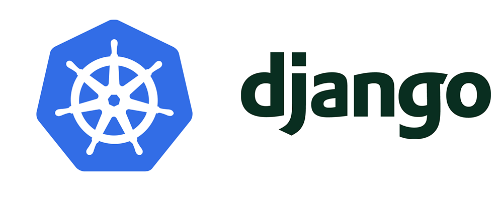

# django-kubernetes
Deploy a production-ready Django application into a Kubernetes cluster.

Kubernetes is a tool to manage containers. This type of management is called orchestration because it does more than just manage the containers such as it will scale up and scale down resources as needed (among many other things). 

This is a practical kubernetes implementation using a Docker-based Django application.

Django is a way to build web applications rapidly using Python. There are many ways to get Django into production so the question is why use K8S at all? There's many reasons we'll cover throughout this series but here are a few:

- Gracefully deploy Docker-based Django projects
- Scale up (or scale down) your web apps with ease
- Use a few or a lot of microservices internally or externally
- Self-heal when services go down
- Simplify app deployment (after initial configuration)
- Streamline your backend Infrastructure (provision virtual machines and let k8s do the rest)

To make this project more approachable here's what we'll be doing:

- Start a Python Virtual Environment
- Create a bare bones production-ready Django project 
- Create a Dockerfile to describe our environment
- Use a managed Database service from DitgitalOcean
- Install Kubernetes locally
- Start a Kubernetes Cluster on AWS
- Provision a Deployment and Service for our Django project
- Implement Github Action Workflows to automate future deployments


### References Codingforentrepreneurs Django-Kubernetes Course
- https://github.com/codingforentrepreneurs/Django-Kubernetes
- [Django on Docker](https://www.codingforentrepreneurs.com/blog/django-on-docker) guide
- [Docker & Docker Compose](https://www.codingforentrepreneurs.com/projects/docker-and-docker-compose) tutorial series
- [Github Actions](https://www.codingforentrepreneurs.com/blog/django-github-actions) guide
- [DigitalOcean $100 credit](https://do.co/cfe-sh) for new accounts
- [Code](https://github.com/codingforentrepreneurs/Django-Kubernetes)


## Cloning this Repo?

Make sure you create `web/.env` and fill in the following variables:

```
DEBUG=1
REGION=
DJANGO_SUPERUSER_USERNAME=
DJANGO_SUPERUSER_PASSWORD=
DJANGO_SUERPUSER_EMAIL=
DJANGO_SECRET_KEY=

POSTGRES_READY=0
POSTGRES_DB=
POSTGRES_PASSWORD=
POSTGRES_USER=
POSTGRES_HOST=localhost
POSTGRES_PORT=5434

REDIS_HOST=redis_db
REDIS_PORT=6388
```
> If you change `POSTGRES_PORT` or `REDIS_PORT` be sure to update those values in `docker-compose.yaml`

Once you have the above `.env` file, navigate to your project root (right where `docker-compose.yaml` is) and run:

```
docker compose up -d
```
This will create a `postgresql` database that's running in the background for you. To bring this database down just run:

```
docker compose down
```
The data in the database will be persistent so you can run `docker compose up -d` again with confidence. 


Also in the root of your project:

```
python3.9 -m venv venv
source venv/bin/activate
pip install -r web/requirements.txt
```
This will ensure your Django project is ready to be used locally.
